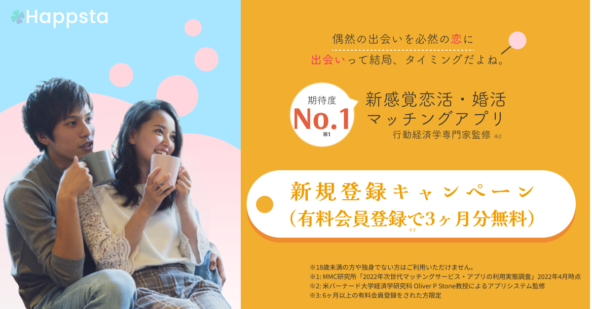

# Design Portfolio

## Banner Design

This repository hosts multiple banner designs.  

Although I am not a designer, I created banners to understand design and designers.  

After that, I have experience in undertaking several banner production projects on crowdsourcing services.  

These are all created for learning purposes, and in consideration of copyrights and confidentiality, client work deliverables are not included.

### List of Banner Designs

#### christmas-sale

* Description: Christmas-themed banner design commonly seen in flyers and other promotional materials.
* Key points:  The color scheme and objects express the feeling of Christmas.
* Tools: Figma

#### matching-app-casual

* Description: Designed with a pop style targeting users who want to enjoy casual romance.
* Key points: Eye-catching design, pop color scheme, rounded objects.
* Tools: Figma

#### matching-app-consistent

* Description: Designed with a calm and sophisticated feel, targeting users seeking serious relationships with marriage in mind.
* Key points: Visual guidance, low contrast, soft color palette.
* Tools: Figma

#### point-return-campaign

* Description: Point redemption campaigned banner, commonly seen in flyers and other promotional materials.
* Key points:  Emphasize the numerical part (especially 100 million yen)
* Tools: Adobe Illustrator

## Other Design

Regarding website designs, they are managed in the following repositories:

* [Website Design](https://github.com/KoyaNimi/website-design)
* Others: [リポジトリURL]

## License

The content of this repository is licensed under the [MIT License](LICENSE.txt).

## Author

Author: Koya Niimi
